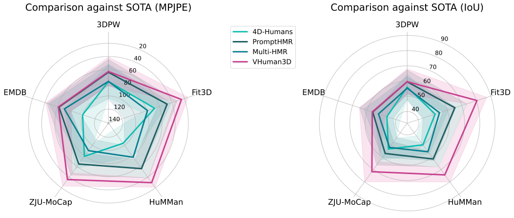
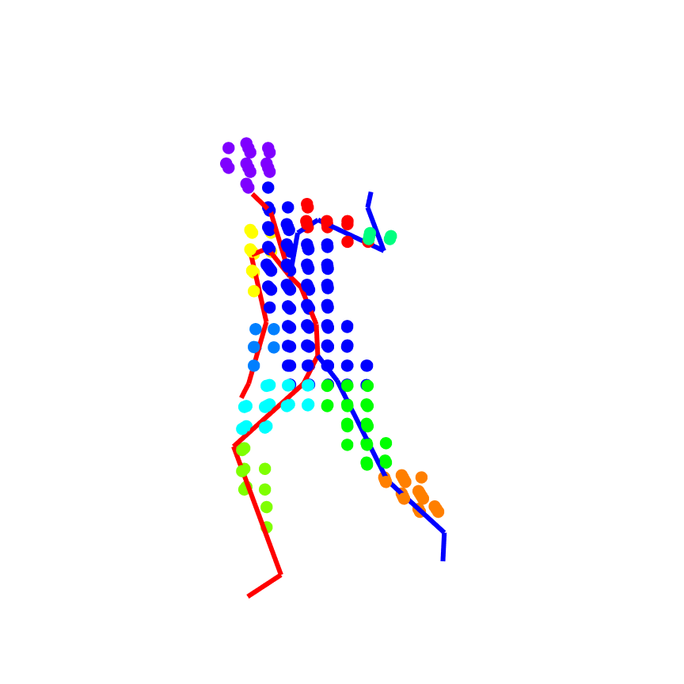
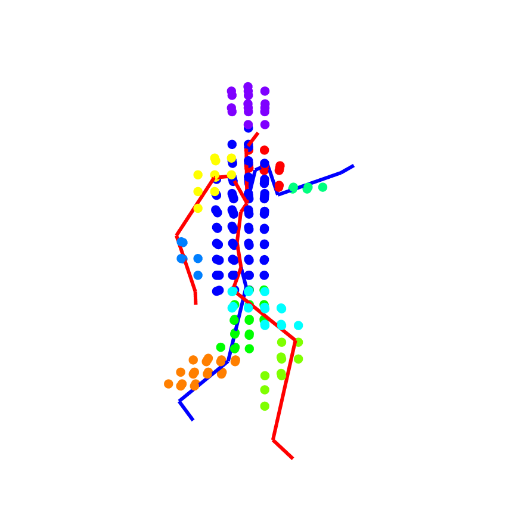
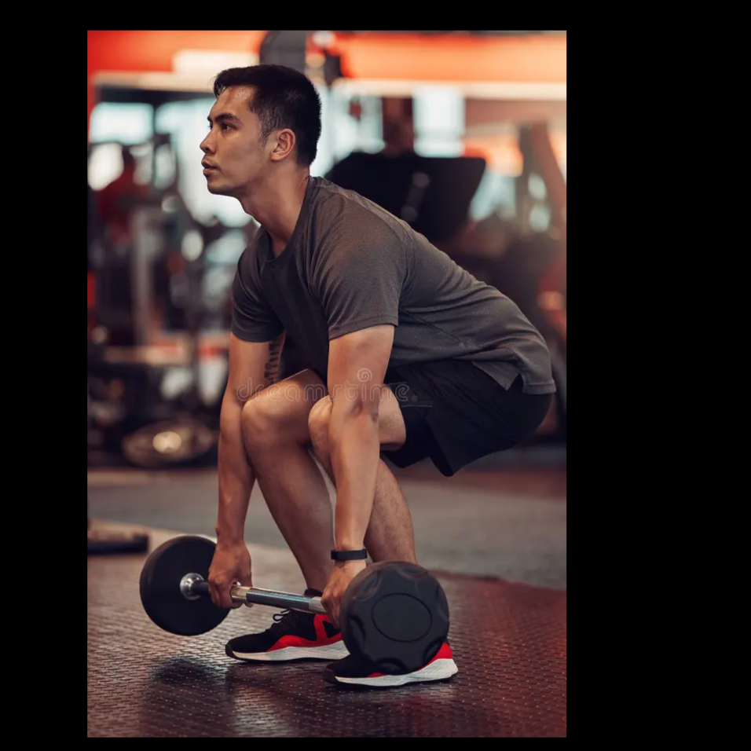
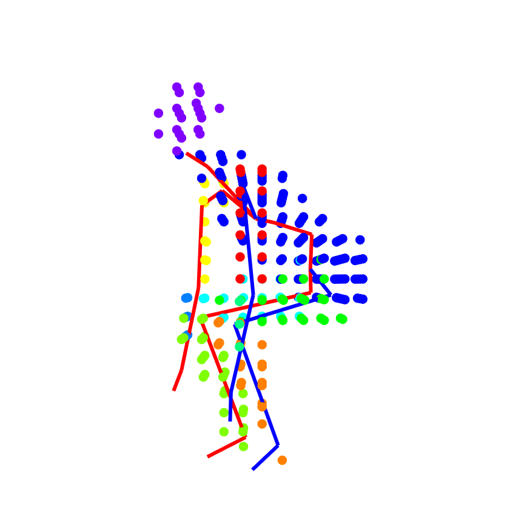
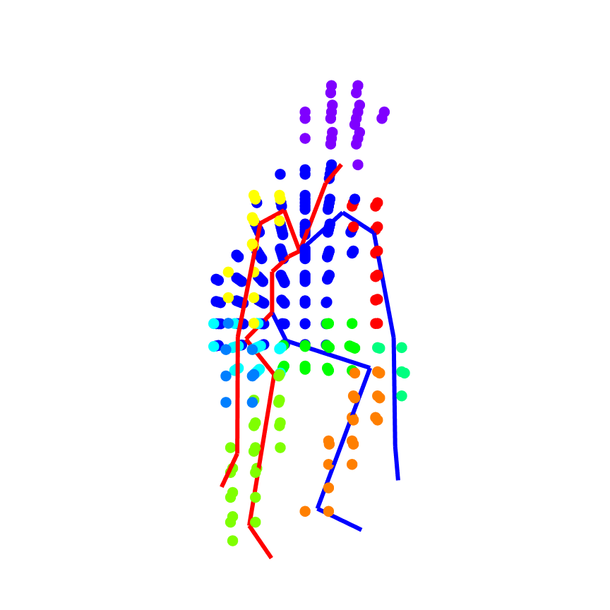
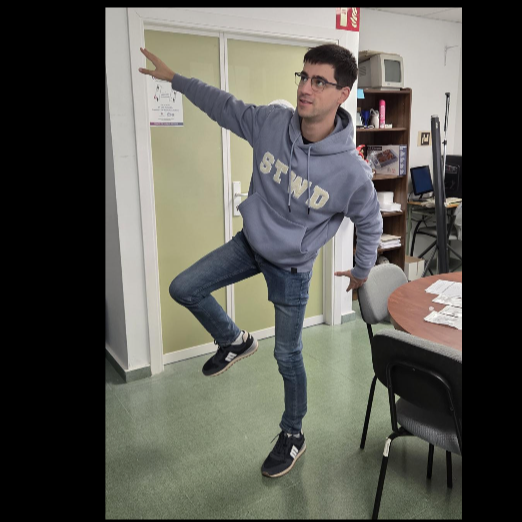
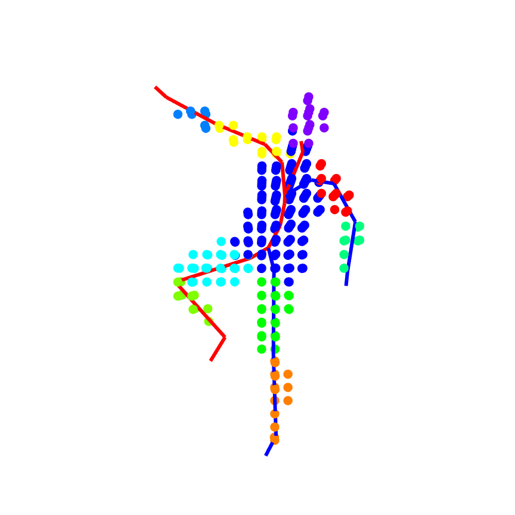
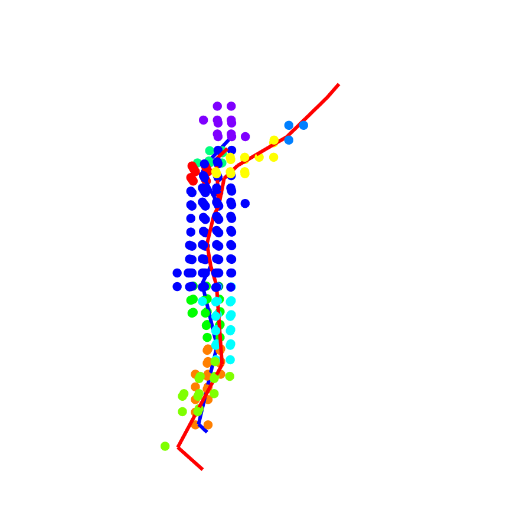

# VHuman3D: Voxel-based Human Pose and Shape Reconstruction with Transformers

  

Support code for the **VHuman3D** method *(coming soon!)*.  
Work by Rafael Berral-Soler, Jorge Zafra-Palma, Rafael Muñoz-Salinas, and Manuel J. Marín-Jiménez.

---

### 🚀 Try the Live Demo: 

Hosted on Hugging Face Spaces using ZeroGPU (sorry for the inconvenience!)

  

## ⚡ Performance & Efficiency

Here is how **VHuman3D** stacks up against popular baseline methods ([4D-Humans](#ref-4d-humans), [PromptHMR](#ref-prompthmr), [Multi-HMR](#ref-multi-hmr)) in speed, memory, and raw accuracy across standard benchmarks ([3DPW](#ref-3dpw), [Fit3D](#ref-fit3d), [HuMMan](#ref-humman), [ZJU-MoCap](#ref-zju-mocap), and [EMDB](#ref-emdb)). 

---

### 🏆 Comparison against baselines 

  

  <i>Comparison of VHuman3D against baseline methods across 3DPW, Fit3D, HuMMan, ZJU-MoCap and EMDB datasets.</i>

---

### ⏱️ Speed & Model Size
*Measured using batch size 1 (after 30 warm-up runs, averaged over 1,000 runs).*

  <table width="100%">
    <thead>
      <tr align="left">
        <th><b>Model</b></th>
        <th align="center"><b>Avg. Time (ms)</b></th>
        <th align="center"><b>Parameters</b></th>
        <th align="center"><b>Autocast / AMP?</b></th>
      </tr>
    </thead>
    <tbody>
      <tr>
        <td><b><a href="#ref-4d-humans">4D-Humans</a></b></td>
        <td align="center">17.47</td>
        <td align="center">672M</td>
        <td align="center">No</td>
      </tr>
      <tr>
        <td><b><a href="#ref-prompthmr">PromptHMR</a></b></td>
        <td align="center">60.10</td>
        <td align="center">479M</td>
        <td align="center">Yes</td>
      </tr>
      <tr>
        <td><b><a href="#ref-multi-hmr">MultiHMR</a></b></td>
        <td align="center">46.09</td>
        <td align="center">317M</td>
        <td align="center">Yes</td>
      </tr>
      <tr>
        <td><b>VHuman3D (Ours)</b></td>
        <td align="center">46.68</td>
        <td align="center">130M</td>
        <td align="center">No</td>
      </tr>
      <tr>
        <td><b>VHuman3D (Ours, bfloat16)</b></td>
        <td align="center"><b>12.12</b></td>
        <td align="center"><b>130M</b></td>
        <td align="center"><b>Yes</b></td>
      </tr>
    </tbody>
  </table>

---

## 🎨 Qualitative Results

> **Note:** The samples shown below are **not** from the training set.

  <table width="100%" style="border-collapse: collapse;">
    <thead>
      <tr style="border: none;">
        <th width="16%" style="border: none; text-align: center;"><b>Input</b></th>
        <th width="16%" style="border: none; text-align: center;"><b>Camera aligned</b></th>
        <th width="16%" style="border: none; text-align: center;"><b>Side view (+90º)</b></th>
        <th width="16%" style="border: none; text-align: center;"><b>Input</b></th>
        <th width="16%" style="border: none; text-align: center;"><b>Camera aligned</b></th>
        <th width="16%" style="border: none; text-align: center;"><b>Side view (+90º)</b></th>
      </tr>
    </thead>
    <tbody>
      <tr align="center" style="border: none;">
        <td style="border: none; padding: 0;"></td>
        <td style="border: none; padding: 0;"></td>
        <td style="border: none; padding: 0;"></td>
        <td style="border: none; padding: 0;"></td>
        <td style="border: none; padding: 0;"></td>
        <td style="border: none; padding: 0;"></td>
      </tr>
      <tr align="center" style="border: none;">
        <td style="border: none; padding: 0;"></td>
        <td style="border: none; padding: 0;"></td>
        <td style="border: none; padding: 0;"></td>
        <td style="border: none; padding: 0;"></td>
        <td style="border: none; padding: 0;"></td>
        <td style="border: none; padding: 0;"></td>
      </tr>
      <tr align="center" style="border: none;">
        <td style="border: none; padding: 0;"></td>
        <td style="border: none; padding: 0;"></td>
        <td style="border: none; padding: 0;"></td>
        <td style="border: none; padding: 0;"></td>
        <td style="border: none; padding: 0;"></td>
        <td style="border: none; padding: 0;"></td>
      </tr>
    </tbody>
  </table>

  <i>Visualization of VHuman3D on challenging samples. From left to right: Input RGB, Frontal reconstruction, and Side (+90º) reconstruction. Voxel-based representation allows for accurate shape recovery even in complex poses.</i>

## Bibliography

### Baseline methods

* **4D-Humans**: Goel et al. (2023) “Humans in 4D: Reconstructing and Tracking Humans with Transformers”, in ICCV 2023. https://doi.org/10.1109/ICCV51070.2023.01358
* **PromptHMR**: Wang et al. (2025) “PromptHMR: Promptable Human Mesh Recovery”, in CVPR 2025. https://doi.org/10.1109/CVPR52734.2025.00115
* **Multi-HMR**: Baradel et al. (2025) “Multi-HMR: Multi-Person Whole-Body Human Mesh Recovery in a Single Shot”, in ECCV 2025. https://doi.org/10.1007/978-3-031-73337-6_12

### Datasets

* **3DPW**: Von Marcard et al. (2018) “Recovering Accurate 3D Human Pose in the Wild Using IMUs and a Moving Camera”, in ECCV 2018. https://doi.org/10.1007/978-3-030-01249-6_37
* **Fit3D**: Fieraru et al. (2021) “AIFit: Automatic 3D Human-Interpretable Feedback Models for Fitness Training”, in CVPR 2021. https://doi.org/10.1109/CVPR46437.2021.00979
* **HuMMan**: Cai et al. (2022) “HuMMan: Multi-modal 4D Human Dataset for Versatile Sensing and Modeling”, in ECCV 2022. https://doi.org/10.1007/978-3-031-20071-7_33
* **ZJU-MoCap**: Peng et al. (2021) “Neural Body: Implicit Neural Representations with Structured Latent Codes for Novel View Synthesis of Dynamic Humans”, in CVPR 2021. https://doi.org/10.1109/CVPR46437.2021.00894
* **EMDB**: Kaufmann et al. (2023) “EMDB: The Electromagnetic Database of Global 3D Human Pose and Shape in the Wild”, in ICCV 2023. https://doi.org/10.1109/ICCV51070.2023.01345
