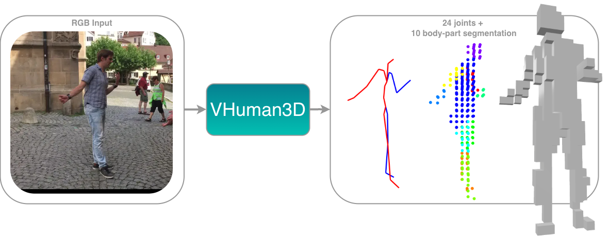
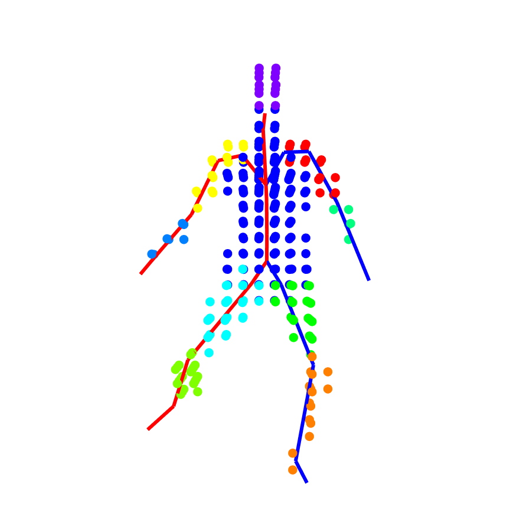
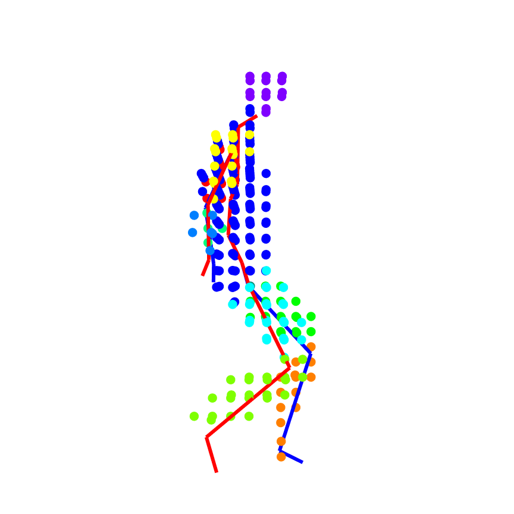
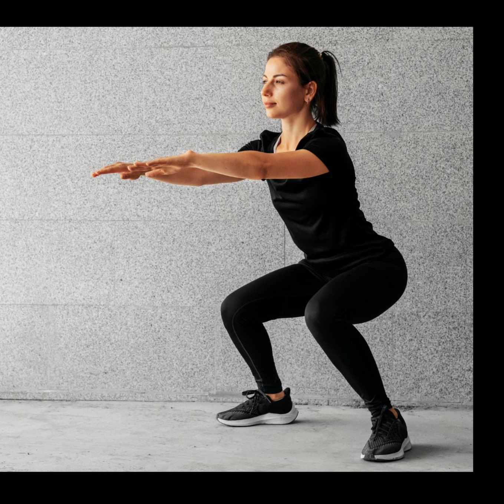
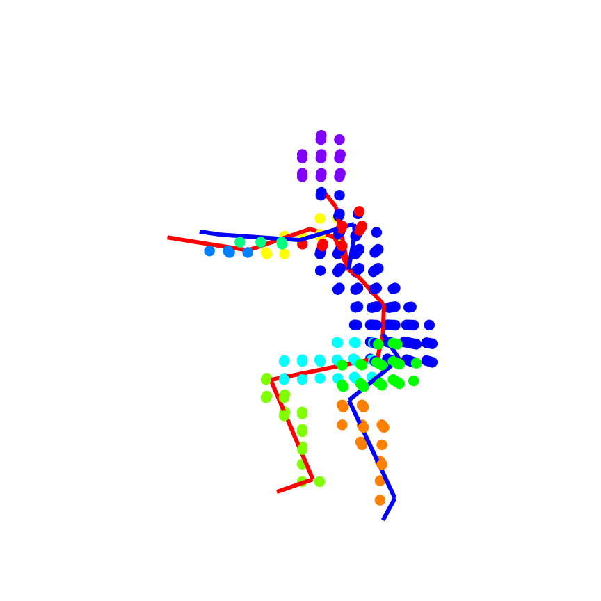
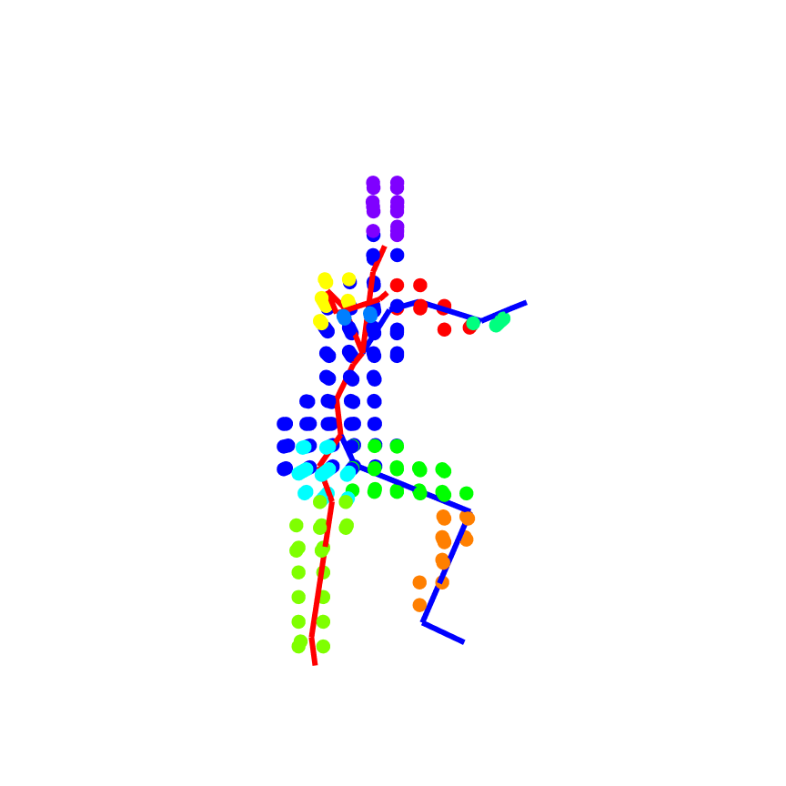
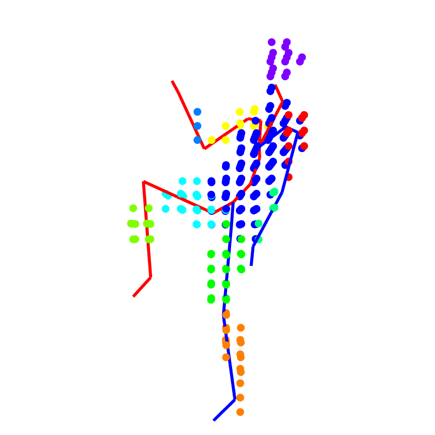
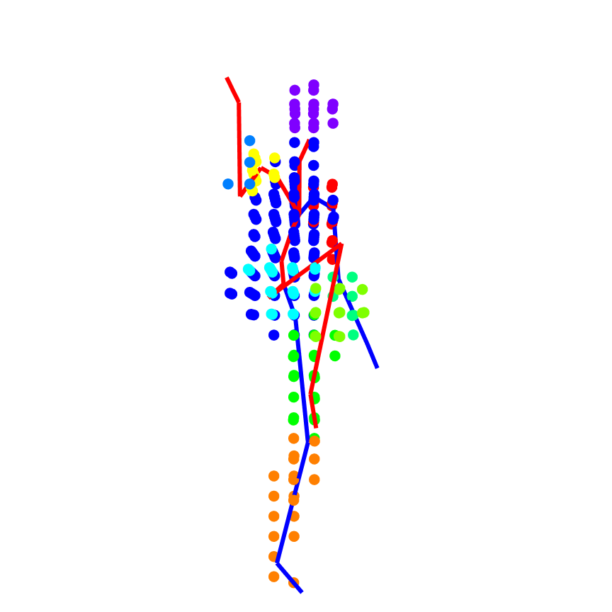

# VHuman3D: Voxel-based Human Pose and Shape Reconstruction with Transformers
Support code for the VHuman3D method (coming soon!). Work by Rafael Berral-Soler, Jorge Zafra-Palma, Rafael Muñoz-Salinas and Manuel J. Marín-Jiménez.

* **NEW (11/07/2026)**: Try our method in this Gradio app (currently self-hosted, sorry for the inconvenience). 

## Qualitative results
Some samples from the dataset:

  
  
  

